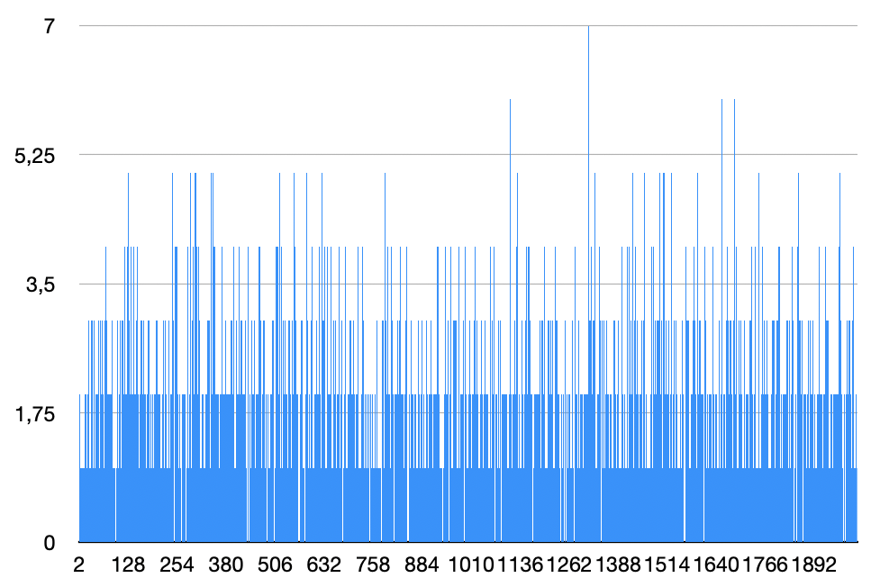

## МОСКОВСКИЙ ФИЗИКО-ТЕХНИЧЕСКИЙ ИНСТИТУТ (НАЦИОНАЛЬНЫЙ ИССЛЕДОВАТЕЛЬСКИЙ УНИВЕРСИТЕТ)

## Физтех-школа Радиотехники и Компьютерных технологий
<br/>


#  

##  Отчёт о выполнении лабораторной работы 3.7.8
#  Оптимизация Хеш-таблицы, основанной на двусвязном списке на массивах, с разрешенной коллизией при помощи знаний ассемблера и Intrinsic функций

<br/>
<br/>
<br/>
<br/>
<br/>
<br/>

## Автор: Житников Андрей Павлович, Б01-303
<br/>
<br/>
<br/>
<br/>
<br/>
<br/>
<br/>
<br/>
<br/>

## Долгопрудный
## 1 апреля, 2024
<br/>
<br/>
<br/>
<br/>
<br/>

# `1 Введение`: 
# *Цель работы*: 
* Написать Хеш-таблицу на С
* Сравнить дисперсию для различных хеш-функций
* Найти узкие места программы с помощью профилировщика
* Ускорить узкие места при помощи Intrinsic функций и ассемблерных оптимизаций
  
# `2 Ход работы`:
## `Нулевая часть работы`: написание хеш таблицы на С, которая хранит английские слова

## За основу таблицы был взят двусвязный список на массивах из репозитория [List](https://github.com/andrushechka37/List). 
## Были реализованы функции:
* Вставки в таблицу
* Поиска данных в таблице
* Чтения данных из файла, заранее обработанного с помощью `get_data_storage`, разбивающей текст на слова и убирающей знаки препинания из текста.
* Текстового дампа с псевдографикой

## `Первая часть работы`: исследование дисперсии различных хеш функций
## Были исследованы несколько хеш функций:
<br/>
<br/>
<br/>
<br/>

## 1. Функция, всегда возвращающая константу
```C
const int random_const = 50;

size_t always_const_func(char * word, int len_of_word) {
    return random_const;
}
```


### Все слова в одном списке - это наихудшее распределение

## 2. Функция, возвращающая ASCII номер первой буквы слова
```C
size_t first_letter_func(char * word, int len_of_word) {
    return word[0];
}
```

### Все еще плохое распределение, видно 2 пика, соответствующих кодам больших и маленьких буквам

## 3. Функция, возвращающая длину слова
```C
size_t word_len_func(char * word, int len_of_word) {
    return len_of_word;
}
```


### Плохое распределение, так как длина слова редко превышает 10

## 4. Функция, считающая контрольную сумму (сумма всех ASCII кодов букв слова) для нескольких размеров таблицы
```C
size_t ascii_sum_func(char * word, int len_of_word) {
    size_t sum = 0;
    for (int i = 0; i < len_of_word; i++) {
        sum += word[i];
    }
    return sum;
}
```
### для размера таблицы 2003


### для размера таблицы 101


### Для небольшого размера таблицы функция дает удовлетворительное распределение, но при увеличении размера таблицы явно видны пики и неравномерность распределения.

## 5. Функция, возвращающая контрольную сумму, деленную на длину слова
```C
int ascii_sum_div_len_func(char * word, int len_of_word) {
    int sum = 0;

    for (int i = 0; i < len_of_word; i++) {
        sum += word[i];
    }

    return sum / len_of_word;
}
```

### Четко виден пик в районе 100, где расположено большинство слов


## 6. Rol xor функция
```C
inline size_t my_rol(size_t x) {
    return (x << 1) | (x >> 63);
}

size_t rol_hash_func(char * word, int len_of_word) {
    size_t hash = 0;
    for (int i = 0; i < len_of_word; i++) {
        hash = my_rol(hash) ^ word[i];
    }
    return hash % hash_table_size;
}

```
## rol:


### Видно, что распределение довольно-таки равномерное, значения в пиках не сильно отличаются от среднего

## Заметим что, при компилировании  с -O1 и выше, my_ror/my_rol заменяются компиллятором на ror и rol соответственно (код взят с сайта [godbolt](https://godbolt.org))

### Компиллятор: x86-64 gcc 13.2
# -O1 и выше:
```assembly
my_ror(unsigned long):
        mov     rax, rdi
        ror     rax
        ret
my_rol(unsigned long):
        mov     rax, rdi
        rol     rax
        ret
```
# -O0:
```assembly
my_ror(unsigned long):
        push    rbp
        mov     rbp, rsp
        mov     QWORD PTR [rbp-8], rdi
        mov     rax, QWORD PTR [rbp-8]
        ror     rax
        pop     rbp
        ret
my_rol(unsigned long):
        push    rbp
        mov     rbp, rsp
        mov     QWORD PTR [rbp-8], rdi
        mov     rax, QWORD PTR [rbp-8]
        rol     rax
        pop     rbp
        ret

```

        
## CRC32


### CRC32 дает лучшее распределение среди всех предыдущих функций

# Результаты измерений

|          hash-func         | Dispersion * $10^3$ |
|:--------------------------:|---------------------|
|        return const        | 7993                |
|       return word[0]       | 7                   |
|      return len(word)      | 72                  |
|      return ascii_sum      | 0.021               |
| return ascii_sum/len(word) | 14                  |
|        rol xor func        | 0.002               |
|            CRC32           | 0.001               |


-------------------------------------------------------------------------------
# `Вторая часть работы`: Оптимизация узких мест программы
## С помощью профилировщика perf были выявлены функции, с самым большим временем исполнения.


# Оптимизация CRC32
## Функция CRC32 была ускорена путем использования intrinsic функций, а именно `_mm_crc32_u8`
```C
size_t CRC32_modified(char * word, int len_of_word) {

	size_t hash = 0;
	uint32_t crc = 0x407EF1CA;

	for (size_t i = 0; i < len_of_word; i++) {
		hash = _mm_crc32_u8 (hash, word[i]);
	}

	return hash % hash_table_size;
}
```

O0 before: 1231 868 \
O3 before: 1232 153 \
O0 after: 83 680 \
03 after: 80 608 

# Оптимизация strcmp при помощи встроенного ассемблера:

```C
int asm_strcmp(const char *word1, const char *word2) {
    int res = 0;

    asm volatile (
        "1:\n"
        "movdqu (%1), %%xmm0\n"       // xmm0 = str1
        "movdqu (%2), %%xmm1\n"       // xmm1 = str2
        "pcmpeqb %%xmm1, %%xmm0\n"    // cmp(1, 2)
        "pmovmskb %%xmm0, %0\n"       // res = cmp(1, 2)
        "test %0, %0\n"               
        "setnz %b0\n"                 
        : "=r" (res)
        : "r" (word1), "r" (word2)
        : "xmm0", "xmm1", "cc"
    );

    if (res == 1) {
        return 0;
    } 
    return res;
}
```

O0 after: 168 428 \
03 after: 167 569

# Оптимизация strlen путем написания ассемблерной функции:

```assembly
asm_strlen:
    xor     rax, rax          
    vxorps  ymm2, ymm2, ymm2 

    vmovdqu ymm0, [rdi]       
    vpcmpeqb ymm1, ymm2, ymm0 
    vpmovmskb eax, ymm1      
    bsf     rax, rax          
    ret                     
```

O0 after: 592 823 \
03 after: 587 127

TODO: Why is it so much slower, that's a BIG question, answer it, please!
TODO: Run existing hash tables to see perfomance difference dense_hash_map by google, sparse_hash_map by google, std::unordered_map, std::map (although this is a map but not a hash map)
TODO: Improve your measuring metadology (use a separate thread for running your program that is not suseptible to random interruptions by task scheduler): https://stackoverflow.com/questions/13583146/whole-one-core-dedicated-to-single-process http://www.hydrogen18.com/blog/howto-give-a-single-process-its-own-cpu-core-in-linux.html https://askubuntu.com/questions/483824/how-to-run-a-program-with-only-one-cpu-core
TODO: Graph of hash map perfomance depening on size (explain what happens)
TODO: Don't store array of lists, it's too wasteful in terms of memory and allocation count and also cache-locality
NOTE: You can read about open addressing, different probing methods and also Robin Good method
