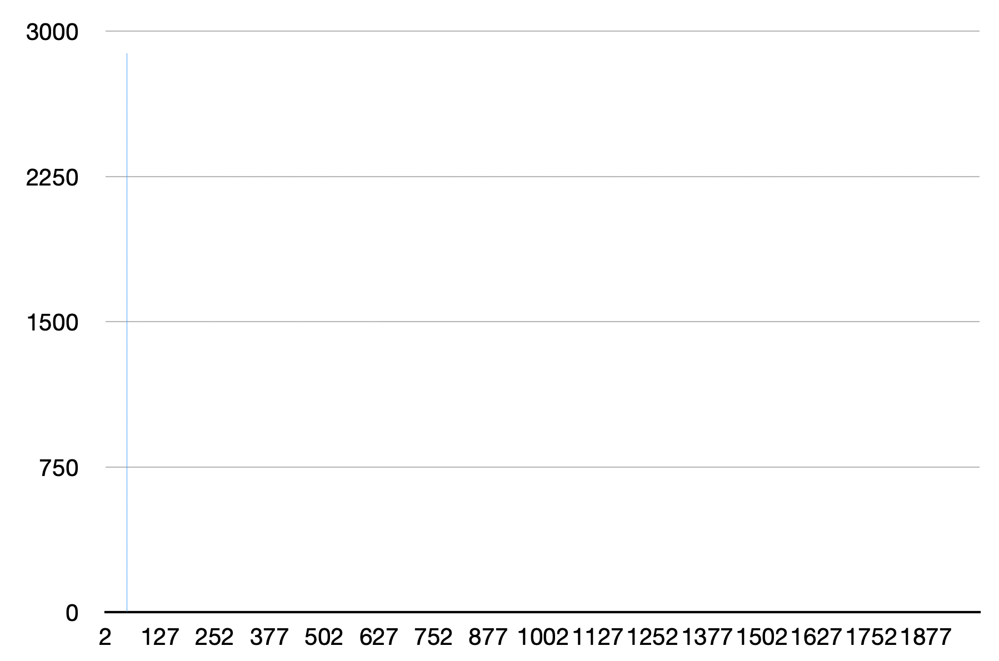
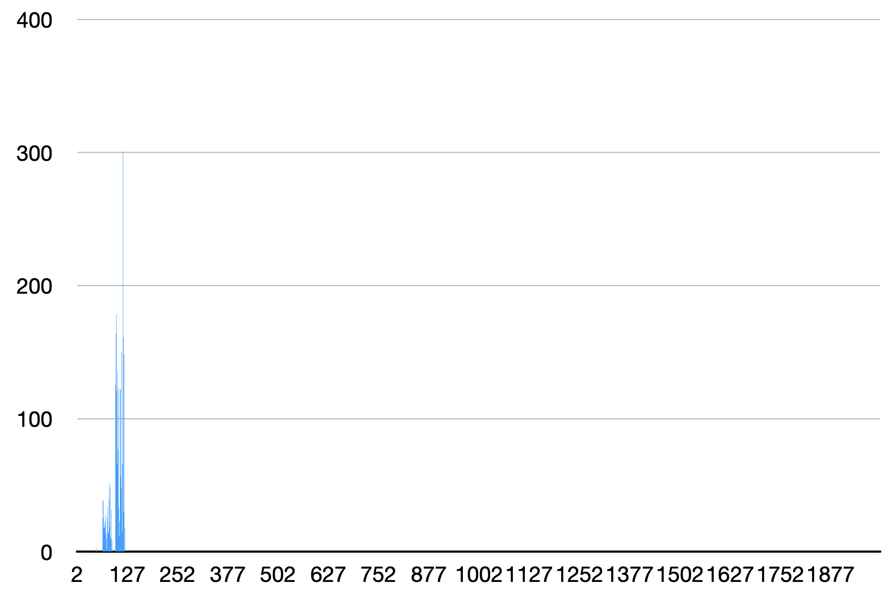
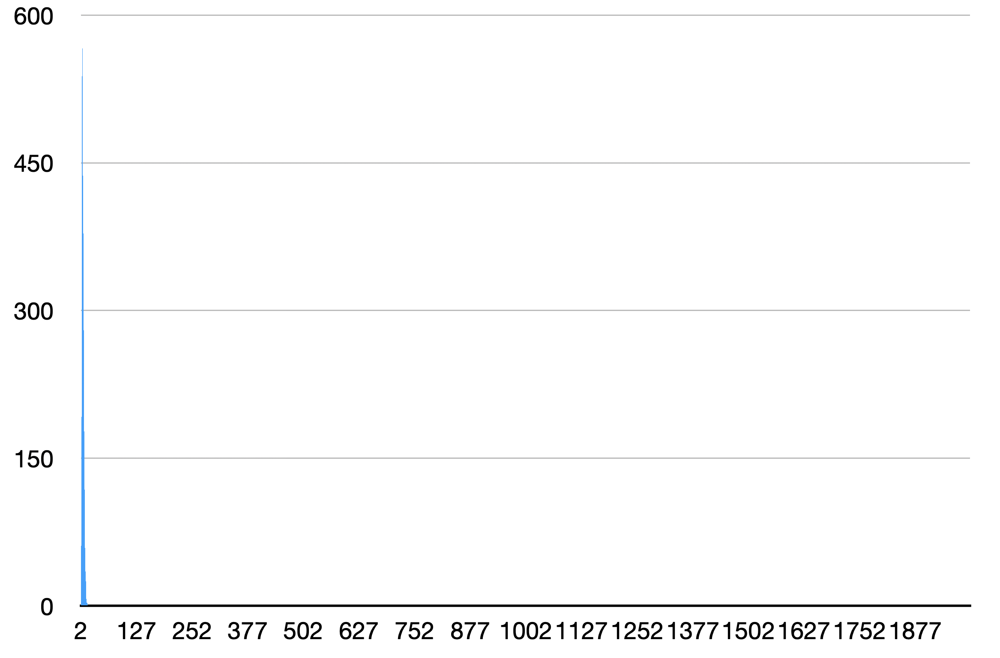
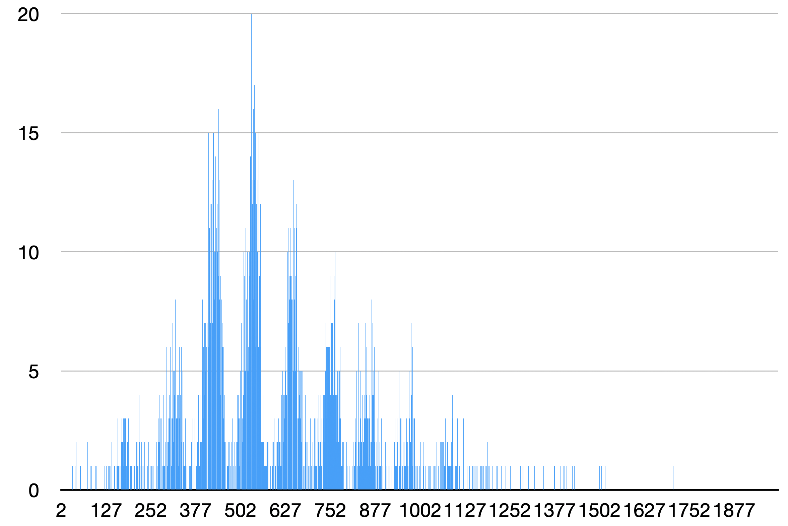
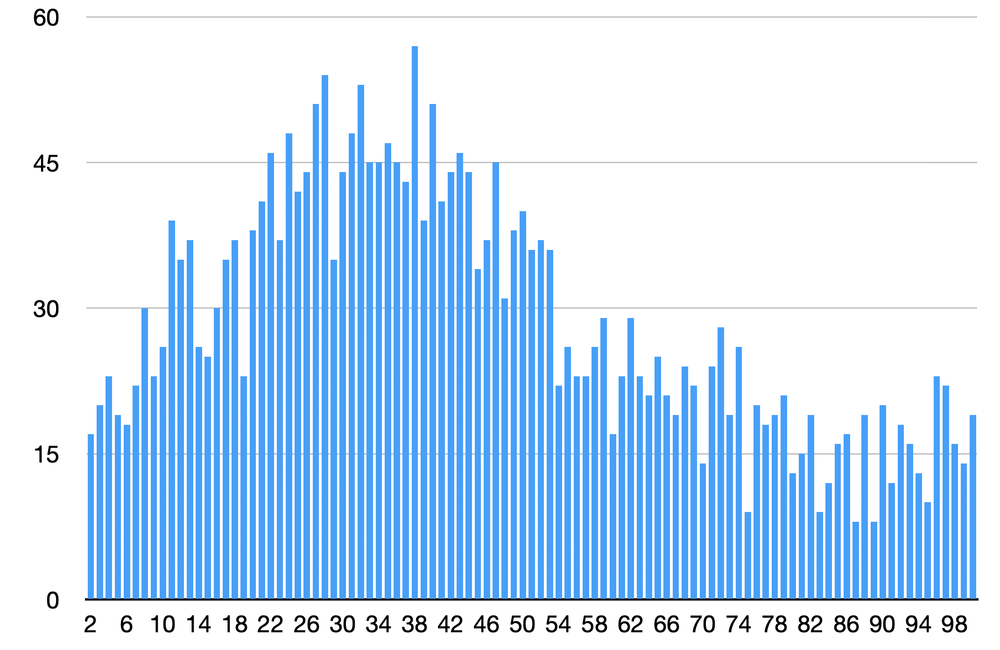
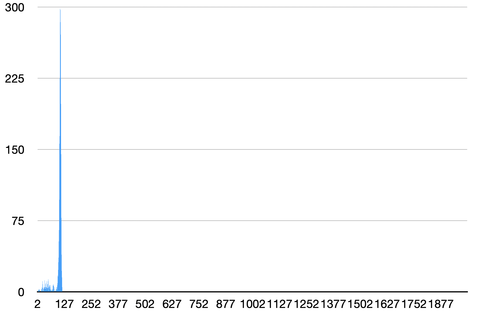
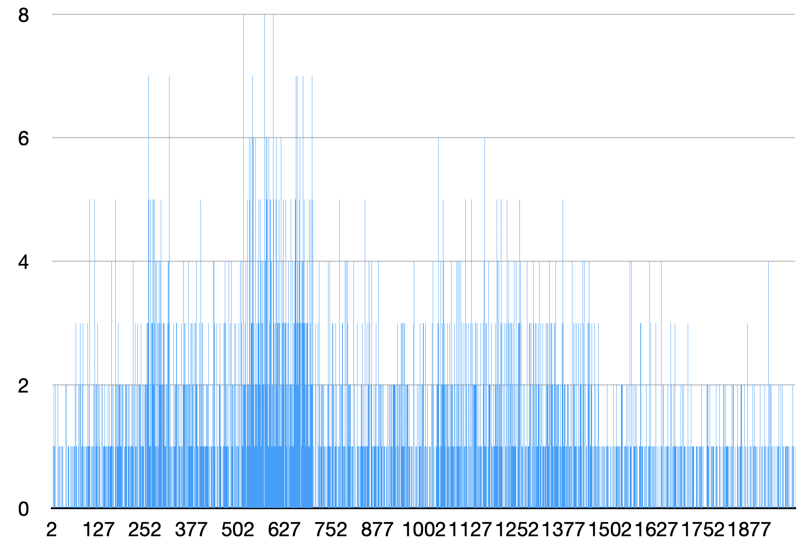

## МОСКОВСКИЙ ФИЗИКО-ТЕХНИЧЕСКИЙ ИНСТИТУТ (НАЦИОНАЛЬНЫЙ ИССЛЕДОВАТЕЛЬСКИЙ УНИВЕРСИТЕТ)

## Физтех-школа Радиотехники и Компьютерных технологий
<br/>


#  

##  Отчёт о выполнении лабораторной работы 2.2.1
#  Оптимизация Хеш-таблицы, основанной на двусвязном списке на массивах, с разрешенной коллизией при помощи знаний ассемблера и Intrinsic функций

<br/>
<br/>
<br/>
<br/>
<br/>
<br/>

## Автор: Житников Андрей Павлович, Б01-303
<br/>
<br/>
<br/>
<br/>
<br/>
<br/>
<br/>
<br/>
<br/>

## Долгопрудный
## 1 апреля, 2024
<br/>
<br/>
<br/>
<br/>
<br/>

# `1 Введение`: 
# *Цель работы*: 
* Написать свою Хеш-таблицу на С
* Сравнить load фактор для различных хеш-функций
* Найти узкие места программы с помощью профилировщика
* Ускорить узкие места при помощи Intrinsic функций и ассемблерных оптимизаций
  
# `2 Ход работы`:
# `Нулевая часть работы`: написание хеш таблицы на С, которая хранит английские слова

## За основу таблицы был взят двусвязный список на массивах из репозитория list. 
## Были реализованы функции:
* Вставки в таблицу
* Поиска данных в таблице
* Чтения данных из файла, заранее обработанного с помощью `get_data_storage`, разбивающей текст на слова и убирающей знаки препинания из текста.
* Текстового дампа с псевдографикой
# `Первая часть работы`: исследование load фактора различных хеш функций
## Были исследованы несколько хеш функций:
<br/>
<br/>
<br/>
<br/>

## Функция, всегда возвращающая константу
```C
const int random_const = 50;

int always_const_func(char * word, int len_of_word) {
    return random_const;
}
```


## Функция, возвращающая ASCII номер первой буквы слова
```C
int first_letter_func(char * word, int len_of_word) {
    return word[0];
}
```



## Функция, возвращающая длину слова
```C
int word_len_func(char * word, int len_of_word) {
    return len_of_word;
}
```

## Функция, считающая контрольную сумму (сумма всех ASCII кодов букв слова) для нескольких размеров таблицы
```C
int ascii_sum_func(char * word, int len_of_word) {
    int sum = 0;
    for (int i = 0; i < len_of_word; i++) {
        sum += word[i];
    }
    return sum;
}
```
### для размера таблицы 2003


### для размера таблицы 101



## Функция, возвращающая контрольную сумму, деленную на длину слова
```C
int ascii_sum_div_len_func(char * word, int len_of_word) {
    int sum = 0;

    for (int i = 0; i < len_of_word; i++) {
        sum += word[i];
    }

    return sum / len_of_word;
}
```


## Ror xor функция
```C
int my_ror(int number) {
    return (number << 1) | (number >> 31);
}

int ror_hash_func(char * word, int len_of_word) {
    int hash = 0;
    for (int i = 0; i < len_of_word; i++) {
        hash = my_ror(hash) ^ word[i];
    }
    return hash % hash_table_size;
}
```
o1
my_ror(unsigned long):
        mov     rax, rdi
        ror     rax
        ret
my_rol(unsigned long):
        mov     rax, rdi
        rol     rax
        ret

o0

my_ror(unsigned long):
        push    rbp
        mov     rbp, rsp
        mov     QWORD PTR [rbp-8], rdi
        mov     rax, QWORD PTR [rbp-8]
        ror     rax
        pop     rbp
        ret
my_rol(unsigned long):
        push    rbp
        mov     rbp, rsp
        mov     QWORD PTR [rbp-8], rdi
        mov     rax, QWORD PTR [rbp-8]
        rol     rax
        pop     rbp
        ret

        

## CRC32


#таблица load факторов и дисперсий