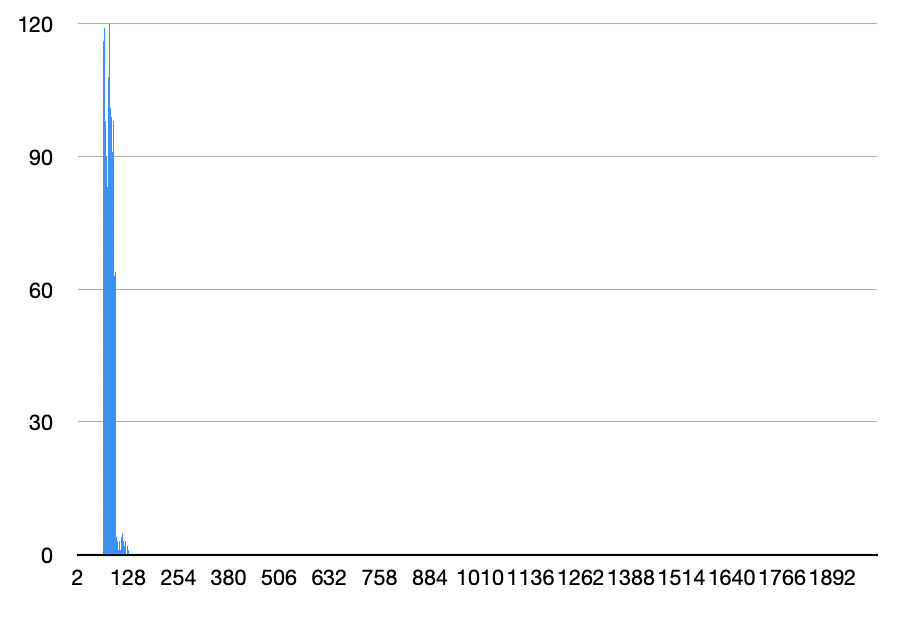

## МОСКОВСКИЙ ФИЗИКО-ТЕХНИЧЕСКИЙ ИНСТИТУТ (НАЦИОНАЛЬНЫЙ ИССЛЕДОВАТЕЛЬСКИЙ УНИВЕРСИТЕТ)

## Физтех-школа Радиотехники и Компьютерных технологий
<br/>


#  

##  Отчёт о выполнении лабораторной работы 3.7.8
#  Оптимизация Хеш-таблицы, основанной на двусвязном списке на массивах, с разрешенной коллизией при помощи знаний ассемблера и Intrinsic функций

<br/>
<br/>
<br/>
<br/>
<br/>
<br/>

## Автор: Житников Андрей Павлович, Б01-303
<br/>
<br/>
<br/>
<br/>
<br/>
<br/>
<br/>
<br/>
<br/>

## Долгопрудный
## 1 апреля, 2024
<br/>
<br/>
<br/>
<br/>
<br/>

# `1 Введение`: 
# *Цель работы*: 
* Написать Хеш-таблицу на С
* Сравнить дисперсию для различных хеш-функций
* Найти узкие места программы с помощью профилировщика
* Ускорить узкие места при помощи Intrinsic функций и ассемблерных оптимизаций
  
# `2 Ход работы`:
## `Нулевая часть работы`: написание хеш таблицы на С, которая хранит английские слова

## За основу таблицы был взят двусвязный список на массивах из репозитория list. 
## Были реализованы функции:
* Вставки в таблицу
* Поиска данных в таблице
* Чтения данных из файла, заранее обработанного с помощью `get_data_storage`, разбивающей текст на слова и убирающей знаки препинания из текста.
* Текстового дампа с псевдографикой
## `Первая часть работы`: исследование дисперсии различных хеш функций
## Были исследованы несколько хеш функций:
<br/>
<br/>
<br/>
<br/>

## 1. Функция, всегда возвращающая константу
```C
const int random_const = 50;

size_t always_const_func(char * word, int len_of_word) {
    return random_const;
}
```


### Все слова в одном списке - это наихудшее распределение

## 2. Функция, возвращающая ASCII номер первой буквы слова
```C
size_t first_letter_func(char * word, int len_of_word) {
    return word[0];
}
```

### Все еще плохое распределение, видно 2 пика, соответствующих кодам больших и маленьких буквам

## 3. Функция, возвращающая длину слова
```C
size_t word_len_func(char * word, int len_of_word) {
    return len_of_word;
}
```


### Плохое распределение, так как длина слова редко превышает 10

## 4. Функция, считающая контрольную сумму (сумма всех ASCII кодов букв слова) для нескольких размеров таблицы
```C
size_t ascii_sum_func(char * word, int len_of_word) {
    size_t sum = 0;
    for (int i = 0; i < len_of_word; i++) {
        sum += word[i];
    }
    return sum;
}
```
### для размера таблицы 2003


### для размера таблицы 101


### Для небольшого размера таблицы функция дает удовлетворительное распределение, но при увеличении размера таблицы явно видны пики и неравномерность распределения.

## 5. Функция, возвращающая контрольную сумму, деленную на длину слова
```C
int ascii_sum_div_len_func(char * word, int len_of_word) {
    int sum = 0;

    for (int i = 0; i < len_of_word; i++) {
        sum += word[i];
    }

    return sum / len_of_word;
}
```

### Четко виден пик в районе 100, где расположено большинство слов


## 6. Rol xor функция
```C
inline int my_rol(size_t x) {
    return (x << 1) | (x >> 63);
}

size_t rol_hash_func(char * word, int len_of_word) {
    size_t hash = 0;
    for (int i = 0; i < len_of_word; i++) {
        hash = my_rol(hash) ^ word[i];
    }
    return hash % hash_table_size;
}

```
## ror:

## rol:


### Для ror происходит странное
### Видно, что распределение довольно-таки равномерное, значения в пиках не сильно отличаются от среднего

## Заметим что, при компилировании  с -O1 и выше, my_ror/my_rol заменяются компиллятором на ror и rol соответственно (код взят с сайта [godbolt](https://godbolt.org))

### Комплилятор: x86-64 gcc 13.2
# -O1 и выше:
```assembly
my_ror(unsigned long):
        mov     rax, rdi
        ror     rax
        ret
my_rol(unsigned long):
        mov     rax, rdi
        rol     rax
        ret
```
# -O0:
```assembly
my_ror(unsigned long):
        push    rbp
        mov     rbp, rsp
        mov     QWORD PTR [rbp-8], rdi
        mov     rax, QWORD PTR [rbp-8]
        ror     rax
        pop     rbp
        ret
my_rol(unsigned long):
        push    rbp
        mov     rbp, rsp
        mov     QWORD PTR [rbp-8], rdi
        mov     rax, QWORD PTR [rbp-8]
        rol     rax
        pop     rbp
        ret

```

        
## CRC32


### CRC32 дает лучшее распределение среди всех предыдущих функций

# Результаты измерений

|          hash-func         | Dispersion * $10^3$ |
|:--------------------------:|---------------------|
|        return const        | 7993                |
|       return word[0]       | 7                   |
|      return len(word)      | 72                  |
|      return ascii_sum      | 0.021               |
| return ascii_sum/len(word) | 14                  |
|        rol xor func        | 0.002               |
|            CRC32           | 0.001               |


  48.41%  list_test  list_test             [.] CRC32
  24.14%  list_test  list_test             [.] hash_table_search
  15.62%  list_test  libc.so.6             [.] __strcmp_sse2_unaligned
   6.90%  list_test  list_test             [.] main
   2.73%  list_test  libc.so.6             [.] __strlen_sse2
   1.31%  list_test  list_test             [.] 0x0000000000001220
   0.84%  list_test  list_test             [.] 0x00000000000011b0
   0.02%  list_test  libc.so.6             [.] __vfscanf_internal
   0.00%  list_test  [kernel.kallsyms]     [k] __lock_text_start
   0.00%  list_test  [kernel.kallsyms]     [k] __run_timers.part.0
   0.00%  list_test  [kernel.kallsyms]     [k] finish_task_switch.isra.0
   0.00%  list_test  [kernel.kallsyms]     [k] rmqueue
   0.00%  list_test  [kernel.kallsyms]     [k] virtqueue_get_buf_ctx_split
   0.00%  list_test  ld-linux-x86-64.so.2  [.] do_lookup_x


strcmp->fast_strcmp


123431 was for 100k operations

120206 now

```C
int fast_strcmp (const char * first, int len1, const char * second, int len2) {

    if (len1 != len2) {
        return 1;
    }

    __m128i first_word =  _mm_loadu_si128((const __m128i_u *)first);
    __m128i second_word = _mm_loadu_si128((const __m128i_u *)second);

    if (len1 > vector_capacity) {
        return strcmp(first, second);
    }

    return _mm_cmpestri(first_word, len1, second_word, len2, _SIDD_UBYTE_OPS);

}
```
 Ну что ж первая оптимизация всегда комом ожидаемо


